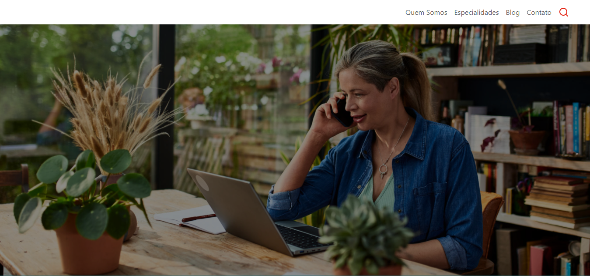

# Teste para Vaga Fullstack Newton




> Projeto desenvolvido para aplicações em processo seletivo para vaga de emprego.

### Tecnologias Utilizadas

- ReactJs
- NextJs
- Typescript
- React Hook Forms
- Tailwind CSS

### Ajustes e melhorias

Melhoria sugeridas para o projeto em questão:

- [ ] Disponibilização de API para consumo  dos dados e envio de formulários;
- [ ] Acréscimo de páginas e  funcionalidades adicionais (ex.: tela de contato, etc.).

## 💻 Pré-requisitos

Para executar o proejto localmente é necessário ter  instalado no seu computador:

- A versão mais recente do `NodeJS`
- Gerenciador de pacotes `NPM`, `YARN` ou `PNPM`.

## 🔧 Instalando as dependências

Para instalar as dependências, siga estas etapas:

```
npm install
```
```
pnpm install
```
```
yarn
```

## ☕ Executando o projeto localmente

Para usar executar o projeto localmente, siga estas etapas, após instalar as dependências:

```
npm run dev
```
```
pnpm run dev
```
```
yarn dev
```

## 🚀 Deploy

> O deploy foi realizado na vercel e pode ser acessado clicando [aqui](https://newton-fullstack-test.vercel.app/)

## 💕 Agradecimentos

> Gostaria de agradecer a Juliana pela rica oportunidade e desde já me disponibilizo para quaisquer esclarecimentos sobre o projeto.

## 🪪 Contatos
<div> 
  <a href="https://instagram.com/kell.romao" target="_blank"></a>
  <a href = "mailto:kelvinsilvadev@gmail.com"></a>
  <a href="https://www.linkedin.com/in/kelvin-oliveira-romao" target="_blank"></a> 
</div>